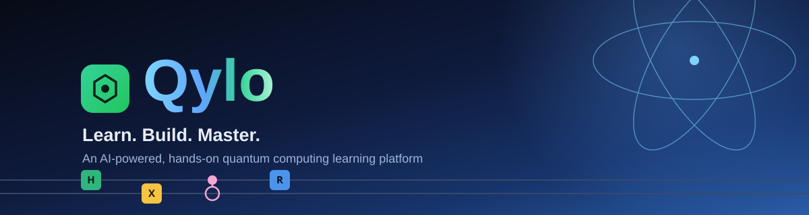
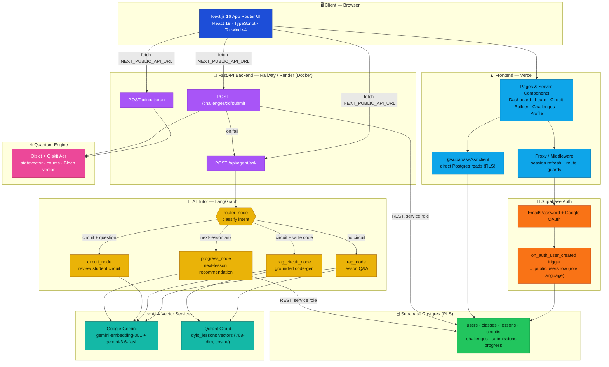
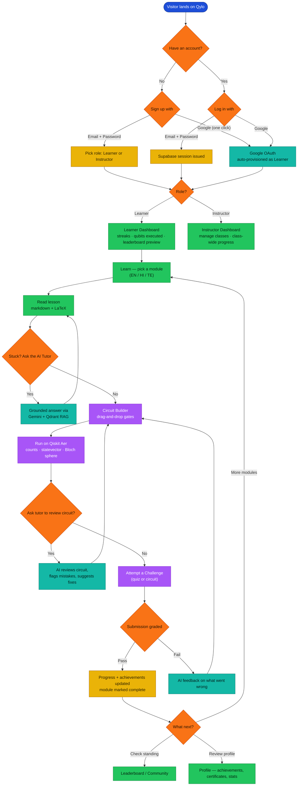

 

## Description

**Qylo** is an AI-powered, multilingual quantum computing learning platform: structured lessons, a real
Qiskit-backed drag-and-drop circuit simulator, a LangGraph-orchestrated AI tutor grounded on the actual
course content, and gamified challenges — all in one connected loop, built for **Smart India Hackathon
(SIH26140)**.

## Problem

Learning quantum computing today means stitching together tools that were never built to teach:

- **Theory and practice live in different places.** Lecture notes/PDFs on one side, a bare-bones circuit
  simulator (built for researchers, not learners) on the other — with nothing connecting the two.
- **No feedback loop.** A student who builds a circuit that doesn't work has no one to ask *why* it's
  wrong, at the moment they're actually stuck.
- **One-size-fits-all pacing.** No sense of what a learner already knows, what they're struggling with,
  or what to study next.
- **English-only.** Most resources shut out students who think in Hindi, Telugu, or any language besides
  English — a real barrier at India's scale.
- **No hands-on grading.** Quizzes test recall, not whether a student can actually build a working circuit.

## Solution

Qylo answers each of those gaps directly:

- 📚 **Structured, multilingual modules** — Fundamentals → Circuit Design → Standard Algorithms →
  Variational/NISQ Algorithms, written in English, Hindi, and Telugu.
- ⚛️ **A real quantum simulator, not a toy** — drag-and-drop gates onto a composer that runs on actual
  **Qiskit + Qiskit Aer**, returning real measurement counts, statevectors, and Bloch-sphere data.
- 🤖 **An AI tutor that routes intelligently, not a generic chatbot** — a **LangGraph** agent that decides,
  per question, whether to answer from the lesson content (RAG over a **Qdrant** vector index), review the
  student's *actual* circuit, generate Qiskit code grounded in the lesson, or recommend the next lesson
  based on real progress — always in the learner's preferred language.
- 🏆 **Challenges with real grading** — quiz and live-circuit-execution challenges, graded automatically,
  with AI-written feedback explaining *why* a failed submission didn't pass.
- 📈 **Progress that's actually tracked** — streaks, qubits executed, achievements, a leaderboard, and a
  separate instructor view for managing classes and watching cohort-wide progress.

## Architecture

Three tiers: a Next.js frontend that talks to Supabase directly for data/auth, a FastAPI backend that owns
everything quantum and AI, and the AI/vector services that power the tutor.

**Why it's split this way:** the frontend reads/writes Supabase directly for anything that's plain CRUD
(lessons, progress, profile) so those pages stay fast server components with no extra network hop. Only
the two things that need real compute — running a quantum circuit, and the AI tutor's reasoning — go to
the FastAPI backend, which is the only thing that talks to Qiskit, Gemini, and Qdrant.

## User Flow Diagram

## How to Run

### 0. One-time project setup

1. Create a free project at [supabase.com](https://supabase.com/dashboard).
2. In the SQL Editor, run these migrations **in order** (skip `0001` — `0002` supersedes it):
   [`0002`](supabase/migrations/0002_fix_users_and_complete_schema.sql) →
   [`0003`](supabase/migrations/0003_seed_phase2_lessons.sql) →
   [`0004`](supabase/migrations/0004_phase5_classes_and_sharing.sql) →
   [`0005`](supabase/migrations/0005_seed_phase5_challenges.sql) →
   [`0006`](supabase/migrations/0006_fix_class_rls_recursion.sql).
   Every migration is idempotent, so re-running one is harmless.
3. Copy the **Project URL**, **anon public key**, and **service role key** from *Project Settings → API*.
4. *(Optional — Sign in with Google)* enable the Google provider under *Authentication → Providers*, and
   add `<your-app-url>/auth/callback` to the *Redirect URLs* allow-list.
5. Grab a free [Gemini API key](https://aistudio.google.com/apikey) and a free
   [Qdrant Cloud](https://cloud.qdrant.io) cluster URL + API key (both power the AI tutor).

### 1. Run the frontend and backend

| Step | 🖥️ Frontend (`/frontend`) | ⚙️ Backend (`/backend`) |
|---|---|---|
| **Prerequisites** | Node.js 20+, npm | Python 3.11+, pip |
| **1. Enter the folder** | `cd frontend` | `cd backend` |
| **2. Copy the env file** | `cp .env.local.example .env.local` | `cp .env.example .env` |
| **3. Fill in the values** | `NEXT_PUBLIC_SUPABASE_URL` `NEXT_PUBLIC_SUPABASE_ANON_KEY` `NEXT_PUBLIC_API_URL` | `SUPABASE_URL` `SUPABASE_SERVICE_ROLE_KEY` `GEMINI_API_KEY` `QDRANT_URL`, `QDRANT_API_KEY` |
| **4. Install dependencies** | `npm install` | `python -m venv .venv` → activate it → `pip install -r requirements.txt` |
| **5. Run the dev server** | `npm run dev` | `uvicorn app.main:app --reload --port 8000` |
| **6. Verify it's running** | [localhost:3000](http://localhost:3000) | [localhost:8000/health](http://localhost:8000/health) → `{"status":"ok"}` |

> **AI tutor, one extra step:** once lessons exist in Supabase (seeded by migration `0003`), run
> `python -m scripts.ingest_lessons` from `backend/` (venv active) to embed and index them into Qdrant —
> that's what the RAG-grounded tutor searches against.

## Tech Stack

<table>
<tr><td valign="top" width="50%">

**Frontend**

App Router, Server Components, KaTeX-rendered lesson markdown, Lenis smooth scroll.

</td><td valign="top" width="50%">

**Backend**

REST endpoints for circuit execution, AI tutoring, and challenge grading.

</td></tr>
<tr><td valign="top" width="50%">

**Quantum Computing**

Real circuit simulation — statevectors, shot-based counts, single-qubit Bloch vectors.

</td><td valign="top" width="50%">

**AI / ML**

`gemini-embedding-001` for retrieval, `gemini-3.6-flash` for generation, a 4-intent LangGraph
router (RAG · circuit review · grounded code-gen · progress) over a Qdrant lesson index.

</td></tr>
<tr><td valign="top" width="50%">

**Database & Auth**

Managed Postgres with row-level security; Auth via Email/Password and Google OAuth.

</td><td valign="top" width="50%">

**Deployment**

Frontend on Vercel; backend containerized with Docker on Railway/Render.

</td></tr>
</table>
